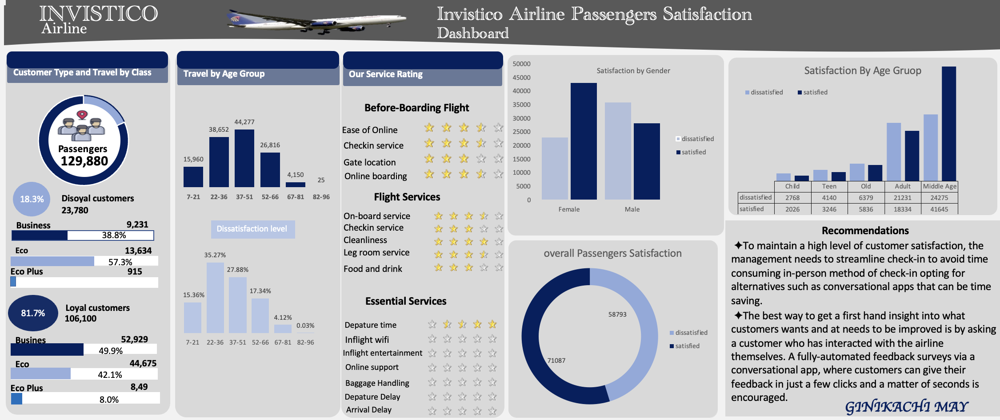

# Invistico_Airline

## Introduction
This is a Microsoft Excel Project done to determine customer satisfaction for an imaginary Airline.

## Problem Statement
1. Percentage of satisfied customers?
2. How do customers rate our services?

## Microsoft Excel Tools Used
1. Excel formulars
2. Pivot Tables
3. Pivot charts
4. Conditional formatting

## Analysis
### Data Sourcing 
This dataset was gotten from Kaggle.com

### Data cleaning
1. In cleaning the dataset, I checked for duplicate columns and values.
2. I also checked for blank cells.
3. I changed the data type to the accurate data types.

### Visualization

**1. Total passengers**

I used customer type to calculate the Total Passengers, and used a text box to represent it.

**2. Travel by Age Gruop**

First I grouped the ages to avoid over crowding of numbers. I put Age and Total Passengers in a pivot table and right clicked on the Age column, then I grouped the ages by 15.

After which I went ahead to visualize the Total Passengers and the percentage of dissatisffied Passengers by Age Group using a colunm chart.
Total Passengers by Age Group | Percentage of Dissatisfied Passengers
:----------:|:----------:
|

**3. Satisfaction by Gender and Age Group**

Both were calculated with Pivot Tables and represented using column charts.

The Age column was grouped using the Nested IF formula `=IF(D:D>=60,"Old",IF(D:D>=36,"Middle Age",IF(D:D>=20,"Adult",IF(D:D>=13,  "Teen","Child"))))`

**4. Overall Passengers Satisfaction**

This was represented using a Doughnut chart.

**5. Service Ratings**

I used the Pivot Table to get the Data, then I copied and pasted the data using Transpose in paste special

Then I used this `=IF($G3>=H$2,1,IF(INT($G3)=H$2-1,MOD($G3,1),0))` to get the average ratings from 1-5, then conditional formatting to represent the average using stars.

While sending all the visuals to the Dashboard sheet, I highlighted the columns containing the stars and reduced their column width to 2.33.

Then i copied only the cells containing the stars and pasted as linked picture in the Dashboard sheet.So any adjustment I make to those cells will reflect on the image.

## Dashboard

## Conclusion
It was fun working on this project, I learnt alot. This project was made possible using this [YouTube video](https://youtu.be/wgs124_AQTI).
